<!--
  ============================================================
   Compassionate4You — Home Health & Hospice Website
   California State University, Sacramento — Team Grey
   Senior Project (CSC 190 / CSC 191)
  ============================================================
-->

<div align="center">


# Compassionate4You

A website rebuild for **Compassionate Home Health & Hospice**, built by **Team Grey** at **California State University, Sacramento**.

<p>
  
  
  
  
  
  
  
  
  
  
</p>

<sub>**Client:** Theresa Naria · **Faculty Advisor:** Kenneth Elliott (CSUS) · **Course:** CSC 190 / 191 · **Target Launch:** December 5, 2026</sub>

</div>

---

## Table of Contents

1. [Synopsis](#synopsis)
2. [Screenshots](#screenshots)
3. [Features](#features)
4. [Tech Stack](#tech-stack)
5. [Architecture](#architecture)
6. [Entity-Relationship Diagram](#entity-relationship-diagram-erd)
7. [Project Structure](#project-structure)
8. [Developer Instructions](#developer-instructions)
9. [Branch & Contribution Workflow](#branch--contribution-workflow)
10. [Testing](#testing)
11. [Deployment](#deployment)
12. [Timeline & Milestones](#timeline--milestones)
13. [The Team](#the-team)
14. [Acknowledgments](#acknowledgments)

---

## Synopsis

Compassionate Home Health & Hospice serves patients and families in the Sacramento area. Their current website runs on GoDaddy and isn't easy for the team to update or for an older user base to navigate.

**Compassionate4You** is the full-stack rebuild: a PERN-stack site with appointment scheduling, an authenticated portal, email/SMS notifications, and a built-in accessibility panel.

The rebuild has three priorities: an accessible front-end for an older user base (text-size, theme, contrast, bilingual EN/ES, help chatbot), a staff-only admin dashboard so content updates don't require a developer, and a real backend (Express + Prisma + PostgreSQL) to replace the static GoDaddy site.

> Built and maintained by **Team Grey**, an eight-person CSUS senior project team, between **January 2026 and December 2026** — across the **Spring 2026** semester (CSC 190) and the **Fall 2026** semester (CSC 191).

---

## Screenshots

Captured from the CSC 190 build (Sprint 4, April 2026).

<div align="center">

|  |  |
| :---: | :---: |
| **Landing Page** | **Home Health Services** |
| 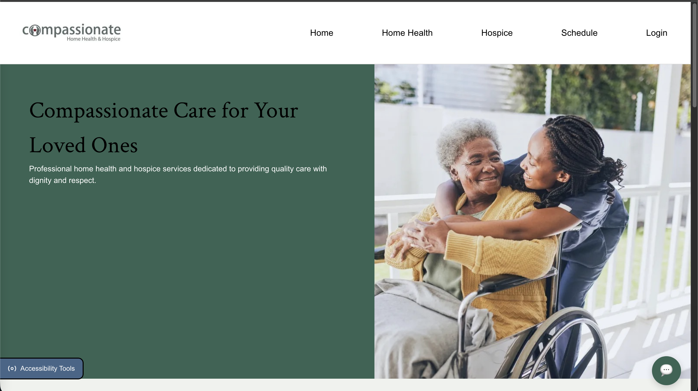 | 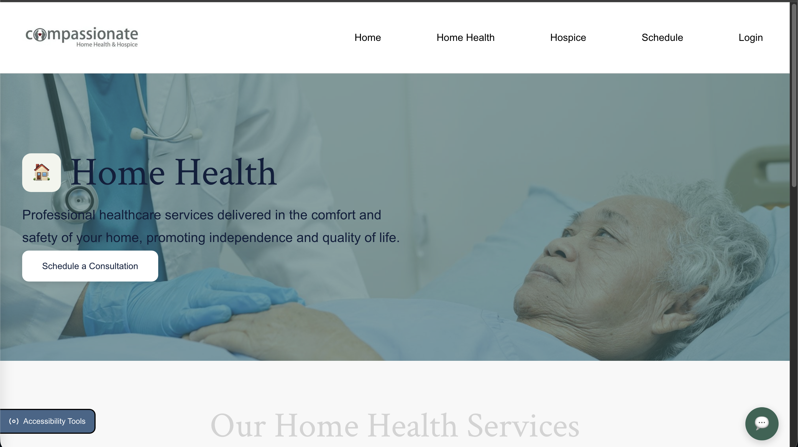 |
| **Hospice Services** | **Locations** |
| 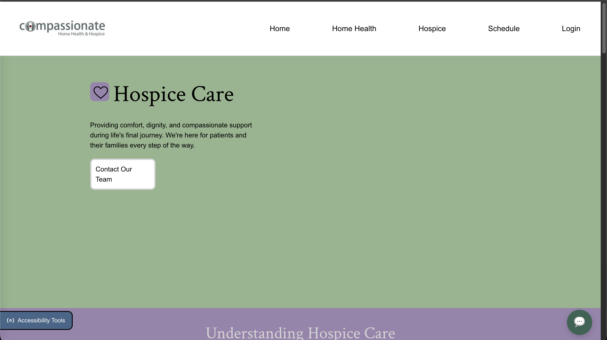 | 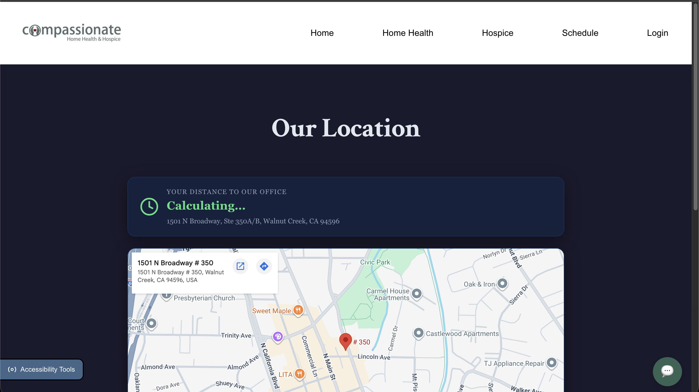 |
| **Appointment Scheduling** | **Patient / Family Portal** |
| 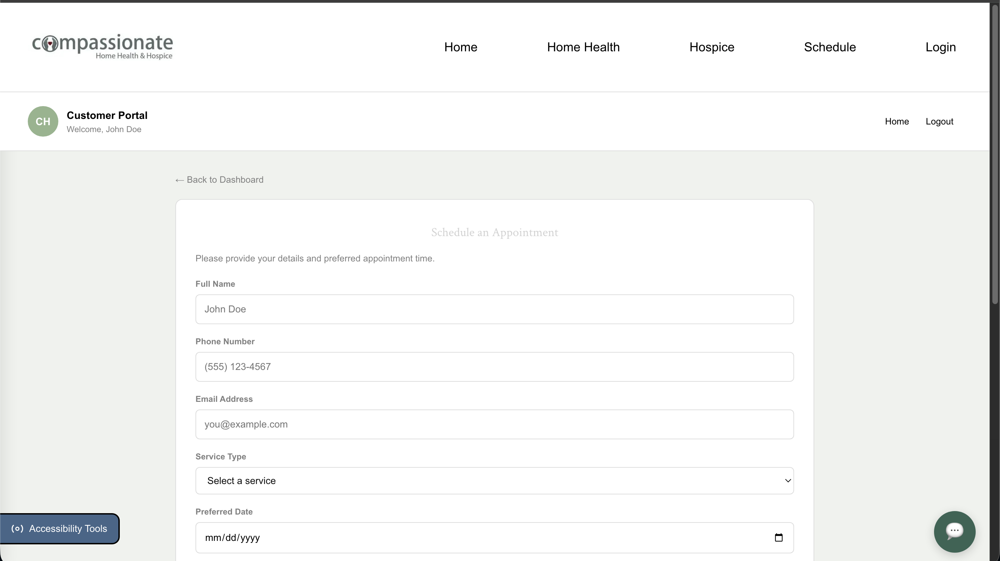 | 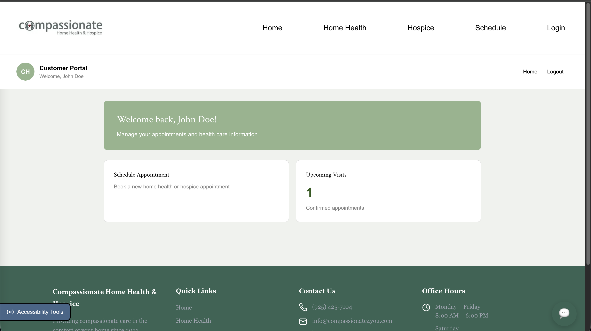 |
| **Admin Dashboard** | **Accessibility Panel** |
| 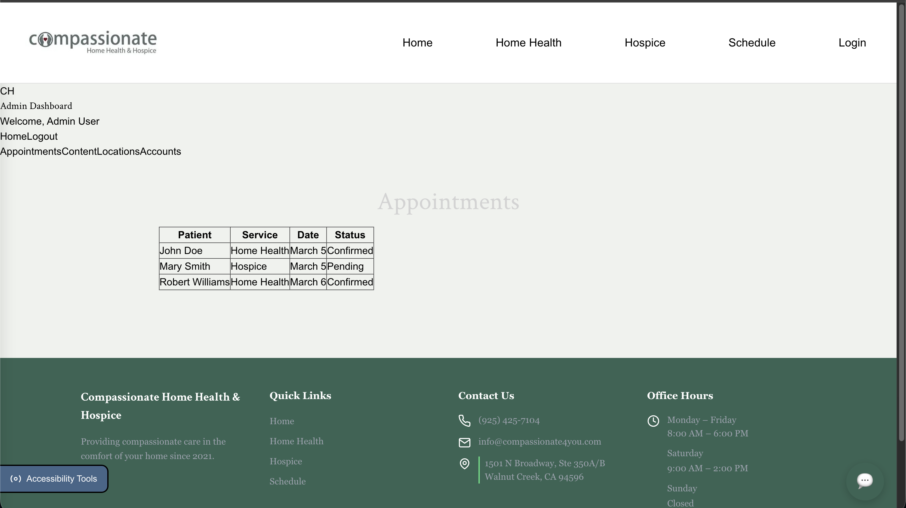 | 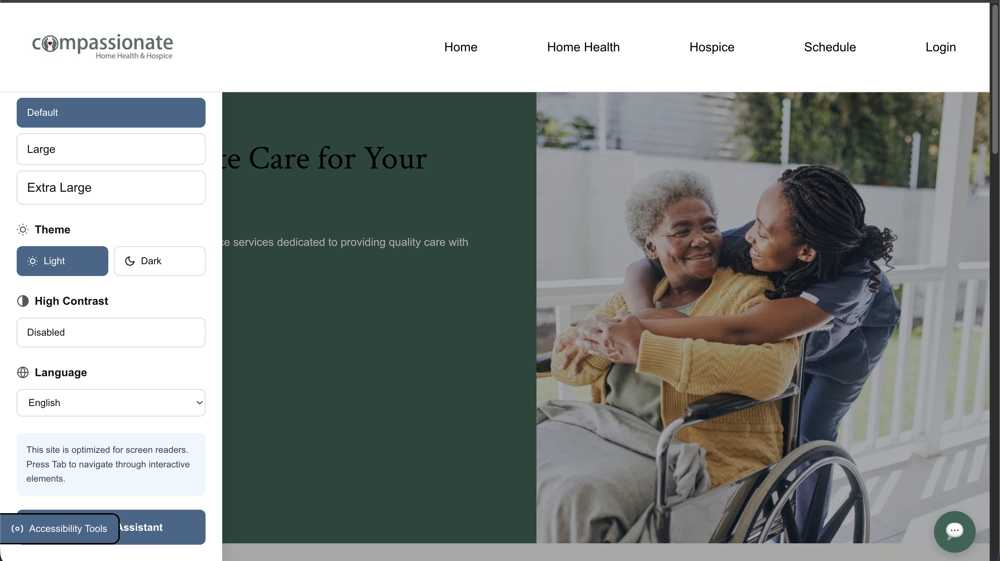 |
| **AI Help Chatbot** | **Mobile View** |
| 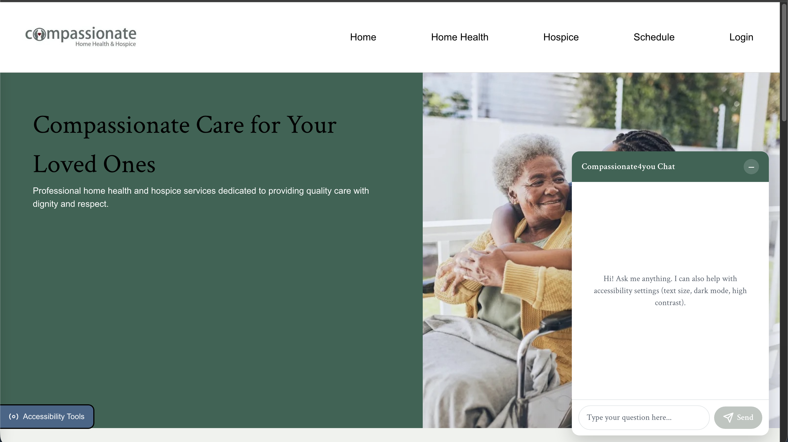 | 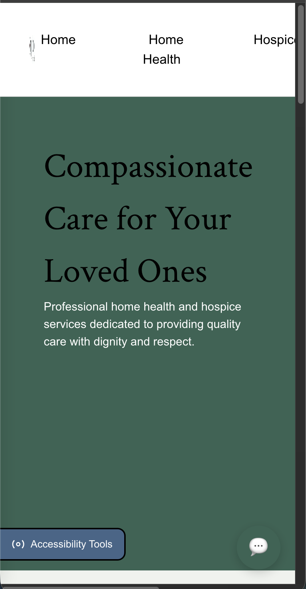 |

</div>

---

## Features

### For patients, families, and visitors

- **Public information pages** — Landing, Home Health, Hospice, Locations, and Contact, all written for a general audience.
- **Appointment scheduling** — Pick a service, date, and time; receive an automated email/SMS confirmation.
- **Patient / Family Portal** — Auth0-protected area for ongoing patients and authorized family members.
- **Accessibility tools:**
  - Text-size controls (default / large / extra-large)
  - Light and dark themes
  - High-contrast mode
  - Language toggle (English / Spanish) via `react-i18next`
  - Screen-reader-friendly markup throughout
- **Help Chatbot** — A floating helper that answers FAQs, links to the relevant page, and can trigger accessibility controls on command (e.g. *"make the text bigger"*). Uses a curated knowledge base of FAQs, navigation links, and accessibility commands — no LLM calls, no external data sent.

### For administrative staff

- **Admin Dashboard** to manage content, locations, accounts, and the appointment queue without touching code.
- **Login & password recovery** flows (currently backed by a placeholder client-side auth; Auth0 wiring lands in CSC 191).
- **Auth0** for identity *(planned for CSC 191)* — so staff never hand passwords to us, and we never store them.
- **Email / SMS notifications** for booked, rescheduled, and canceled appointments *(planned for CSC 191; target volume 600–3,000 messages/month)*.

### Under the hood

- **PERN stack** end-to-end (PostgreSQL · Express 5 · React 19 · Node 24).
- **Prisma 7** for the data layer.
- **Vite 8** for instant client builds.
- **`express-oauth2-jwt-bearer`** installed and ready for the protected-route wiring landing in CSC 191.
- **CORS-aware** API split with a clean `/api/*` surface.
- **i18n-first** UI — every visible string flows through `react-i18next`.

---

## Tech Stack

| Layer | Tooling |
| :--- | :--- |
| **Frontend Framework** | React 19, React Router 7 |
| **Build Tool** | Vite 8 |
| **Internationalization** | i18next 25, react-i18next 16 (English, Spanish) |
| **Styling** | Plain CSS (global + page-scoped stylesheets) |
| **Backend Framework** | Express 5 (CommonJS) |
| **Runtime** | Node.js 24.14 (pinned via `.nvmrc`) |
| **ORM** | Prisma 7 + `@prisma/client` |
| **Database** | PostgreSQL |
| **Authentication** | Auth0 — `express-oauth2-jwt-bearer` *(package installed; middleware wiring TBD in CSC 191)* |
| **Notifications** | Email + SMS provider *(integration TBD in CSC 191)* |
| **Linting** | ESLint 9 + `eslint-plugin-react-hooks`, `eslint-plugin-react-refresh` |
| **Dev Server** | `nodemon` for the API, `vite` for the client |
| **Hosting (planned)** | Render (web service + managed Postgres) |
| **Version Control** | Git + GitHub (branch-per-developer workflow) |
| **Project Management** | Jira (project key **DT-**) |

---

## Architecture

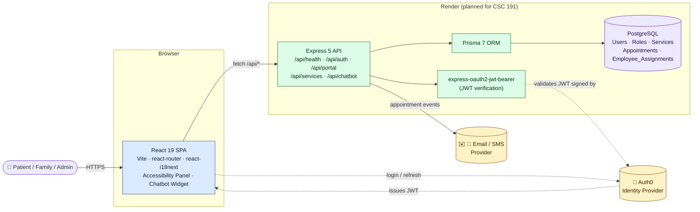

A high-level view of how requests flow through the system:

- The **React client** is a Vite-built SPA, served statically by Render.
- All API calls go through `client/src/services/api.js`, which reads `VITE_API_URL` and prefixes `/api`.
- The **Express server** exposes a versioned `/api/*` surface. Protected routes (portal, admin, appointments) pass through Auth0-issued JWTs verified by `express-oauth2-jwt-bearer`.
- **Prisma** owns the database connection and migrations against **PostgreSQL**.
- Outbound **email / SMS** notifications are dispatched from server-side jobs after appointment writes.

---

## Entity-Relationship Diagram (ERD)

<div align="center">
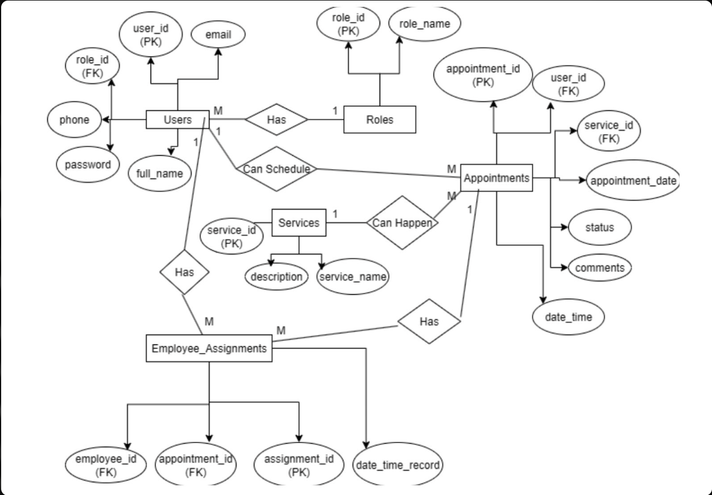
</div>

Five core entities drive the data model: **Users** (with role-based access), **Roles** (admin / patient / family), **Services** (home health, hospice), **Appointments**, and **Employee_Assignments** linking staff to scheduled visits. The canonical schema source is [`server/prisma/schema.prisma`](server/prisma/schema.prisma); Prisma migrations land in CSC 191 Sprint 5.

---

## Project Structure

```
Compassionate4youSite/
├── client/                            # React 19 + Vite SPA
│   ├── public/
│   ├── src/
│   │   ├── assets/                    # Images, logos
│   │   ├── components/
│   │   │   ├── accessibility/         # Accessibility panel + controls
│   │   │   ├── chatbot/               # Floating AI help widget (see chatbot README)
│   │   │   │   ├── app_imports/       # ChatbotWidget.jsx entry
│   │   │   │   ├── components/        # ChatWindow, MessageList, ChatInput…
│   │   │   │   ├── data/              # FAQ + nav + company info
│   │   │   │   ├── engine/            # matcher · responseBuilder · contentFilter
│   │   │   │   ├── hooks/             # useChatbot · useChatHistory · accessibility bridge
│   │   │   │   └── services/          # chatHistoryApi
│   │   │   └── layout/                # Navbar, Footer
│   │   ├── context/                   # AuthContext, AccessibilityContext
│   │   ├── locales/                   # en/, es/ translation JSON
│   │   ├── pages/                     # Landing, HomeHealth, Hospice, Schedule, Portal, Admin…
│   │   ├── routes/                    # AppRoutes.jsx
│   │   ├── services/                  # api.js (fetch client)
│   │   ├── styles/                    # global, page, and layout CSS
│   │   ├── App.jsx
│   │   ├── i18n.js
│   │   └── main.jsx
│   ├── .env.example                   # VITE_API_URL
│   └── package.json
│
├── server/                            # Express 5 API
│   ├── prisma/
│   │   └── schema.prisma              # Prisma datasource + models
│   ├── src/
│   │   ├── config/                    # db.js
│   │   ├── controllers/               # auth · portal · services · chatbot
│   │   ├── middleware/                # auth (JWT) · error
│   │   ├── routes/                    # /api/auth · /api/portal · /api/services · /api/chatbot
│   │   ├── app.js                     # Express app wiring
│   │   └── server.js                  # Listen + graceful shutdown
│   ├── prisma.config.ts
│   ├── .env.example                   # DATABASE_URL, AUTH0_*, PORT
│   ├── index.js                       # Entry shim → src/server.js
│   └── package.json
│
├── database/                          # Reference SQL (Prisma is authoritative)
│   ├── schema.sql
│   └── seed.sql
│
├── .nvmrc                             # Node 24.14.0
├── .gitignore
└── README.md                          # ← you are here
```

---

## Developer Instructions

> **Placeholder section — to be completed in CSC 191.**

Setup instructions for running the project locally — to be filled in during CSC 191. Will cover:

- **Prerequisites** — exact versions of Node (pinned via `.nvmrc`), npm, PostgreSQL, and an Auth0 tenant for protected routes.
- **Cloning & branch setup** — how to fork, clone, and check out the right working branch.
- **Database bootstrap** — creating the local Postgres database, applying Prisma migrations, and seeding starter data.
- **Server configuration** — populating `server/.env` (`DATABASE_URL`, `AUTH0_DOMAIN`, `AUTH0_AUDIENCE`, `PORT`) and running the API in dev vs. production modes.
- **Client configuration** — populating `client/.env` (`VITE_API_URL`) and running the Vite dev server.
- **Common scripts** — the canonical `npm` script reference for both packages (`dev`, `build`, `lint`, Prisma commands).
- **Troubleshooting** — known gotchas (port collisions, Auth0 callback URLs, Prisma client regeneration, etc.).

Until the section lands, contributors can rely on the in-repo `.env.example` files and the scripts already defined in `client/package.json` and `server/package.json`.

---

## Branch & Contribution Workflow

Team Grey uses a **branch-per-developer** workflow with a shared `dev` integration branch in front of `main`.

```
user branch  →  dev  →  main
```

- **user branch** — Each developer codes on their own branch and pushes there.
- **dev** — User branches are merged into `dev`. All conflict resolution and integration testing happens here. `dev` is where the team confirms everything works together.
- **main** — Once `dev` is clean, conflict-free, and tested, a single push lands the changes on `main`. No further merge work at this stage.

Active developer branches mirror our team:

```
Brandon-Huynh    Christian-Alfaro    David-Gonzalez    Gandhar-Tare
Horacio-Ambriz   Mamon-Poian         Preston-Ball      Sukhraj-Sanghera
```

Conventions:

- Commit messages reference the Jira ticket(s) they fulfill, e.g.
  `DT-336: client-side login + password reset UI`.
- Pull request granularity varies by developer — some open a PR per ticket, others batch several tickets into a single PR at the end of a sprint. Either is fine as long as the resulting `dev` build is green.
- All conflict resolution happens on `dev`, not `main`.
- `main` is always deployable.

---

## Testing

> **Placeholder section — to be completed in CSC 191.**

The testing strategy will cover three layers:

- **Unit tests** — Pure functions (chatbot matcher, response builder, content filter, server-side validators). Tooling target: **Vitest** for the client, **Jest** or **Vitest** for the server.
- **Integration tests** — API endpoints against a disposable Postgres instance. Tooling target: **Supertest** + **Prisma** test database.
- **End-to-end tests** — Critical user flows (book an appointment, sign in, change accessibility settings, ask the chatbot a question). Tooling target: **Playwright**.

Coverage goals, CI gating, and test data seeding will be detailed here once the test suite lands.

---

## Deployment

> **Placeholder section — to be completed in CSC 191.**

Target platform: **Render**.

- **Web service** for the Express API (build: `npm install` · start: `npm start`).
- **Static site** for the Vite client (build: `npm run build` · publish: `dist/`).
- **Managed PostgreSQL** add-on, connected via `DATABASE_URL`.

Out-of-scope-today but tracked for 191:

- CI/CD via GitHub Actions (lint + tests on every PR; deploy on merge to `main`).
- Environment promotion: `dev` branch → preview, `main` → production.
- Auth0 tenant separation (dev vs. prod).
- Notification provider credentials (email/SMS) stored as Render secrets.
- Runbook for rollbacks and database backups.

---

## Timeline & Milestones

Two semesters at CSUS: **CSC 190** (Spring 2026) for design and prototype, **CSC 191** (Fall 2026) to finish the backend, deploy, and hand off to the client. Sprints are two weeks long and tracked in Jira under project key **DT-**.

### CSC 190 — Spring 2026 *(completed)*

| Sprint | Window | Theme | Key Deliverables |
| :---: | :--- | :--- | :--- |
| **Sprint 1** | Feb 22 – Mar 7, 2026 | Foundations & Design | Tech-stack research · authentication research · ERD design · SQL vs. NoSQL decision · cost estimates (DB + APIs) · Figma mockups for Home, Home Health, Hospice, Admin, Content & Locations · email mockups (appointment reminders + password reset) · client kickoff review |
| **Sprint 2** | Mar 8 – Mar 22, 2026 | Core UI Build-out | Landing page · global header & navigation · routing to Home Health / Hospice / Schedule / Login · Admin Dashboard shell with Appointments / Content / Locations / Accounts tabs · Portal welcome + upcoming-visits widget · Accessibility panel skeleton (open/close, light, text size, language, high-contrast) · Chatbot widget skeleton (floating button, expand/minimize, input field) · Home Health information sections |
| **Sprint 3** | Mar 30 – Apr 12, 2026 | Styling, i18n & Admin | Landing page CSS pass · Hospice page · Home Health hero + services layout · footer scoping · `react-i18next` integration (English / Spanish) · accessibility tools functionality testing · Admin Dashboard accounts management · scheduling pages · accessibility refactor |
| **Sprint 4** | Apr 13 – Apr 26, 2026 | Auth, Chatbot & Admin Polish | Client-side login system · password-reset flow · chatbot question system + final styling · Admin Dashboard Content & Locations tabs · Home Health advantages / specialty / call-to-action sections · Hospice page visual refinement · dark / light theme toggle wired up · text-size accessibility control |

> Sprint 1–4 closed with all committed stories at status **Done**. Detailed story-level history lives in Jira project **DT-**.

### CSC 191 — Fall 2026 *(planned)*

Dates here are approximate — the real CSC 191 sprint calendar is set after the semester starts. Five two-week sprints plus a final QA / handoff window.

| Sprint | Target Window | Theme | Planned Deliverables |
| :---: | :--- | :--- | :--- |
| **Sprint 5** | Late Aug – early Sep 2026 | Backend data layer | Prisma models & migrations · seed data · `database/schema.sql` regenerated from Prisma · server-side controllers and routes wired up (auth, portal, services) |
| **Sprint 6** | Sep 2026 | Auth0 + protected APIs | Auth0 tenant provisioning · JWT verification middleware live · login / signup / password-reset wired to the backend · role-based access for admin vs. patient |
| **Sprint 7** | Late Sep – Oct 2026 | Scheduling & notifications | Full appointment scheduling end-to-end (create / reschedule / cancel) · email + SMS provider integration · automated confirmations and reminders |
| **Sprint 8** | Oct – early Nov 2026 | Patient portal + admin CRUD | Patient / family portal completion · Admin Dashboard CRUD (content, locations, accounts, appointments) · chatbot knowledge base populated · chatbot ↔ accessibility command bridge |
| **Sprint 9** | Nov 2026 | Deploy, QA & accessibility | Render deployment (web service + managed Postgres) · CI/CD via GitHub Actions · WCAG audit · cross-browser & mobile QA · performance pass |
| **Final** | **December 5, 2026** | **CSC 191 submission & client handoff** | Client UAT · final bug-fix sprint · documentation handoff · production cutover to Compassionate Home Health & Hospice |

> Sprints are two weeks long and run back-to-back, with the only break falling across Sac State's Spring 2026 spring recess (March 23–29). The live source of truth is our Jira board (project **DT-**).

---

## The Team

<div align="center">

**Team Grey** — California State University, Sacramento · CSC 190 / 191

</div>

| Member | Role | GitHub |
| :--- | :--- | :--- |
| Brandon Huynh | Developer | [@Brandon-Huynh](https://github.com/Compassionate4you/Compassionate4youSite/tree/Brandon-Huynh) |
| Christian Alfaro | Developer | [@Christian-Alfaro](https://github.com/Compassionate4you/Compassionate4youSite/tree/Christian-Alfaro) |
| David Gonzalez | Developer | [@David-Gonzalez](https://github.com/Compassionate4you/Compassionate4youSite/tree/David-Gonzalez) |
| Gandhar Tare | Developer | [@Gandhar-Tare](https://github.com/Compassionate4you/Compassionate4youSite/tree/Gandhar-Tare) |
| Horacio Ambriz | Developer | [@Horacio-Ambriz](https://github.com/Compassionate4you/Compassionate4youSite/tree/Horacio-Ambriz) |
| Mamon Poian | Developer | [@Mamon-Poian](https://github.com/Compassionate4you/Compassionate4youSite/tree/Mamon-Poian) |
| Preston Ball | Developer | [@Preston-Ball](https://github.com/Compassionate4you/Compassionate4youSite/tree/Preston-Ball) |
| Sukhraj Sanghera | Developer | [@Sukhraj-Sanghera](https://github.com/Compassionate4you/Compassionate4youSite/tree/Sukhraj-Sanghera) |

**Client:** Theresa Naria — *Compassionate Home Health & Hospice*

---

## Acknowledgments

- Theresa Naria and the team at Compassionate Home Health & Hospice — our client.
- Kenneth Elliott — CSC 190 / 191 faculty advisor at CSUS.

---

<div align="center">
<sub>Team Grey · CSUS · 2026</sub>
</div>
